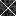
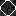
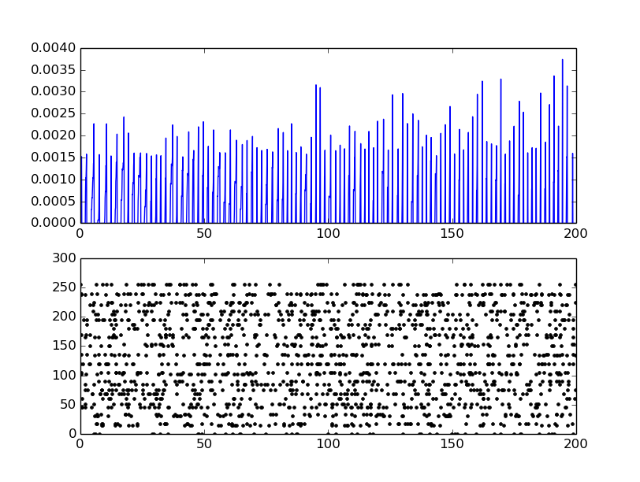
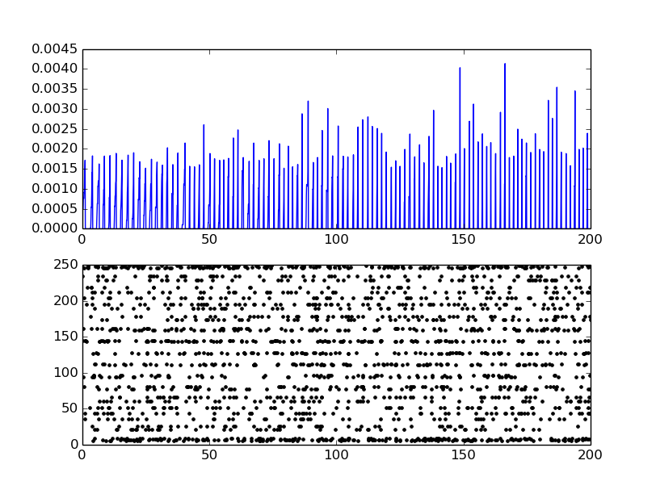

### BRIAN Demo

This is a demo of training of a spiking neural network using STDP learning rule. Two very distinct patterns are presented to the network :

<p align="center">  </p>

* Each image is presented for 200 ms with a maximum spike frequency of 50 Hz. This is done just for the purpose of           demonstrating how weights align themselves according to the input.

> Otherwise, it is not advised to send too many spikes from a single sample if we have a large dataset to train the network because in that case weights will be moulded drastically according to the first few samples and would result in poor performance. We would like to have a gradual change of weights to accommodate all types of patterns.
    
* The input training dataset is normalized (0-1) and each pixel value is converted to firing rate with maximum rate of 50 Hz ('on' pixel). Spikes trains are generated using PoissonGroup function which generates spikes according to Poisson distribution.
            
      PoissonGroup(par.vis_size, x[j]*Hz)
      
 First argument gives the size of the input layer and second one describes the firing rate for each of them.

* Spiking Neural Network are generative i.e the weights align themselves in shape of the input. If we reconstruct trained weights then they resemble the pattern they are trained to. For instance, after presenting the above two images, when the weights corresponding to each output neurons were set in form of a 16x16 image and interpolated to the values between 0 to 255:

     **Neuron 1:**  <br /> 
     **Neuron 2:** 
  
  We can see that it's quite obvious that neuron 1 is trained for 'X' and neuron 2 is trained for 'O' i.e neuron would give maximum output spikes for input 'X' and similarly neuron 2. **Hence, this is a good parameter to check the performance of a spiking neural network.**
  
* BRIAN has inbuilt functions to keep record of the membrane activities of neurons - <br />

  ``` bash 
      M = StateMonitor(G, 'v', record=True)
  ```
   
  ``` bash
      spikemon = SpikeMonitor(P)
  ```

*StateMonitor* records the membrane potential of neurons throughout the simulation and *SpikeMonitor* records the times at which the neurons spike. Here are the graphs ploted during the simulation:

<p align="center">  </p>
                             <p align="center">   Input 'X' </p>
<p align="center"> </p>
<p align="center"> Input 'O' </p>
<br />
In each of the above graphs first part shows the membrane potential of the corresponding output neuron and second part shows the spiking activity of input neurons.

### Parameter Analysis

#### Learning Rate
This parameter determines the size of a weight update when a hidden layer neuron spikes, and controls how
quickly the system changes its weights to approximate the input distribution.
   
   - Higher learning rate develop fast receptive fields but in improper way. Accuracies increase fast but reaches a plateau much earlier.
   - Lower learning rate results in better training but requires more samples to reach the highest accuracy.
   
   
